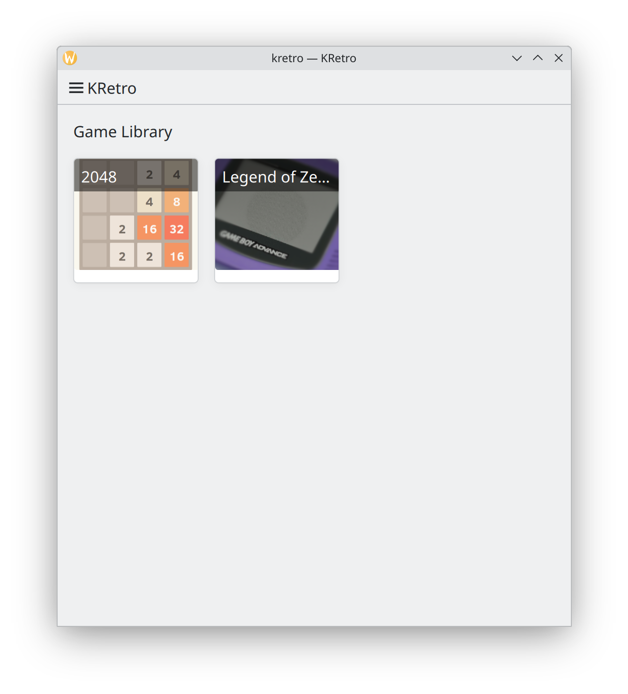
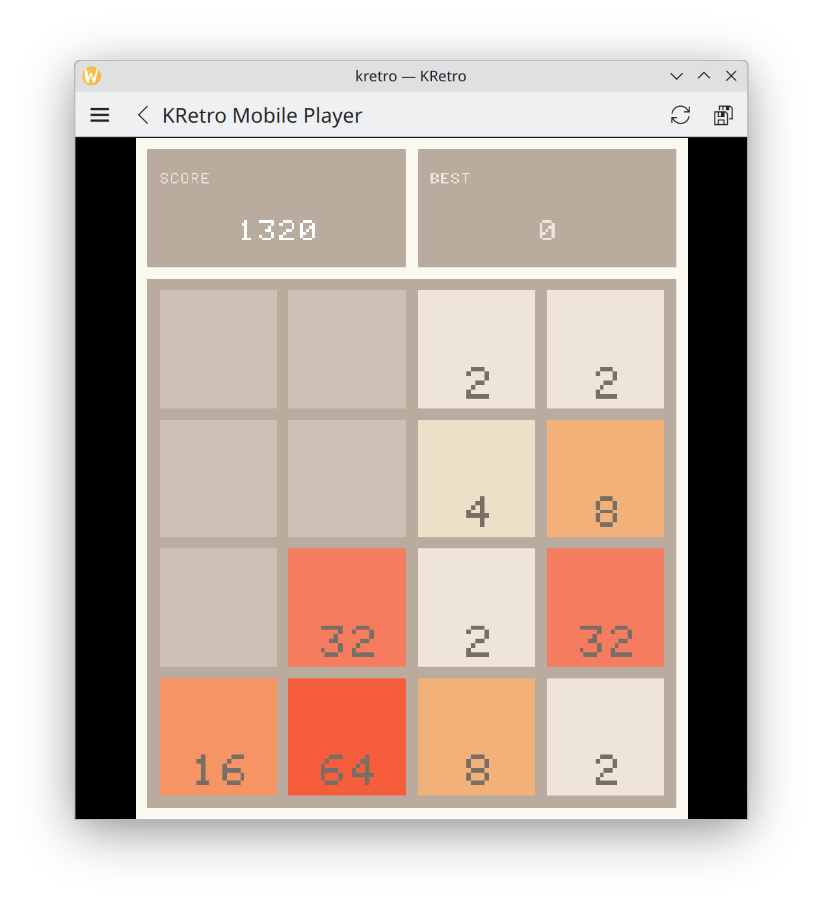

<!--
- SPDX-FileCopyrightText: 2025 Seshan Ravikumar <seshan@sineware.ca>
- SPDX-License-Identifier: FSFAP
-->

# KRetro - Libretro Emulation Frontend for Plasma

Play your favourite games across Plasma platforms: in your pocket, desktop or TV!

> KRetro is a work in progress! Contributions are welcome!

<div style="display: flex; flex-direction: row; gap: 10px; overflow-x: auto; margin: 20px 0;">
  
  
  
</div>

## Cores

Currently, the following cores are integrated:

**x86_64**
- 2048_libretro
- mednafen_gba_libretro
- quicknes_libretro
- snes9x_libretro

**arm64**
- 2048_libretro
- mednafen_gba_libretro

## Building and Testing
It is recommend to use `kde-builder`. Add the following to your `~/.config/kde-builder/config.yaml` file:

```yaml
project kretro:
  repository: git@invent.kde.org:seshpenguin/kretro.git
```
Then, you can build kretro: `kde-builder kretro`

To run kretro, first source the prefix, then run the app:

```bash
source ~/kde/build/kretro/prefix.sh
kretro

# To test the mobile player:
QT_QUICK_CONTROLS_MOBILE=1 QT_QUICK_CONTROLS_STYLE=org.kde.breeze kretro
```