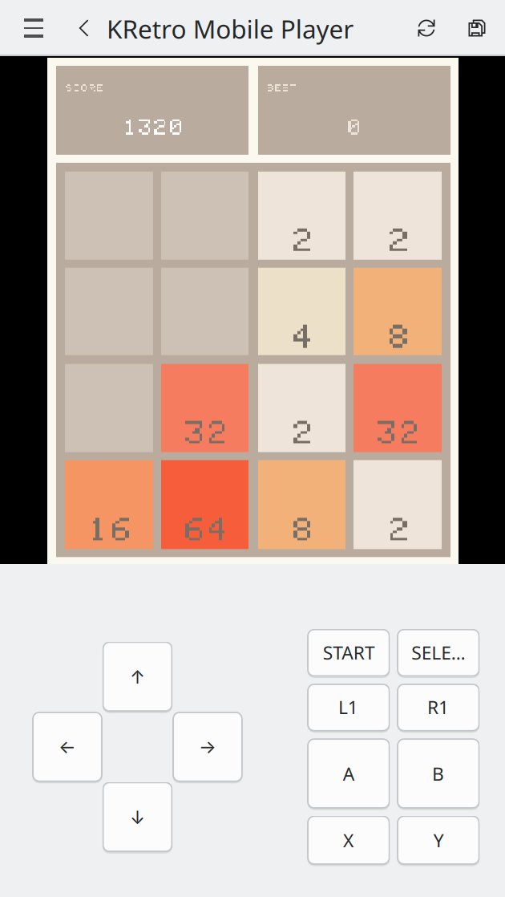

# KRetro - Libretro Emulation Frontend for Plasma

Play your favourite games across Plasma platforms: in your pocket, desktop or TV!

> KRetro is a work in progress! Contributions are welcome!

## Cores
Currently, the following cores are integrated:
**x86_64**
- 2048_libretro
- mednafen_gba_libretro
- quicknes_libretro
- snes9x_libretro

**arm64**
- 2048_libretro
- mednafen_gba_libretro